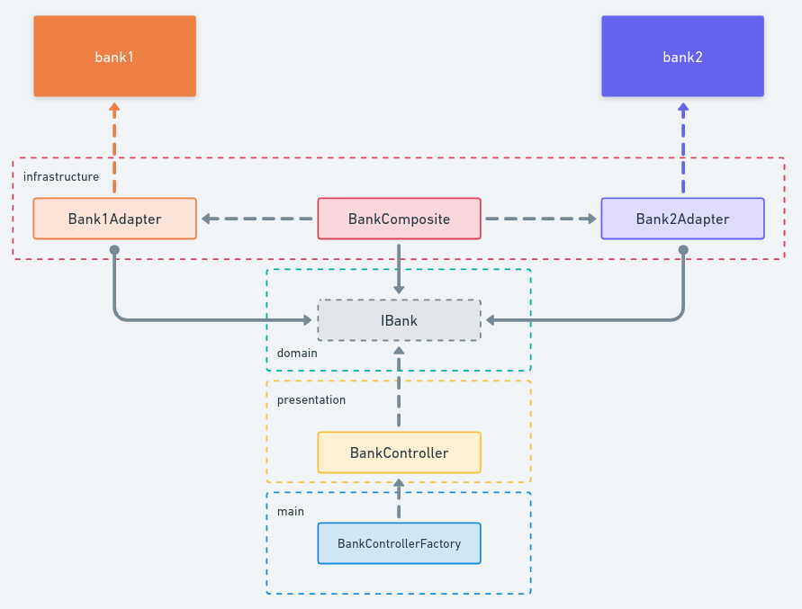

# Challenge

## Objective
The challenge here is that we don’t want the BankController to ever directly use any classes in the com.bank1 and com.bank2 packages. Instead, you need to create an abstraction layer (using, for instance, an Adaptor pattern) that isolates and “hides” the bank1 and bank2 classes behind a common interface and data structures. Your solution should demonstrate appropriate separation of responsibilities and code isolation. 

A small hint, as there are different versions of the Adaptor pattern - the point is to create an abstraction that makes bank1 and bank2 look the same, not to create an adaptor that makes, for instance, bank1 look like bank2.

## Solution Overview



## Running the application

- To run the code: ```npm start```
- To run the unit tests: ```npm test```